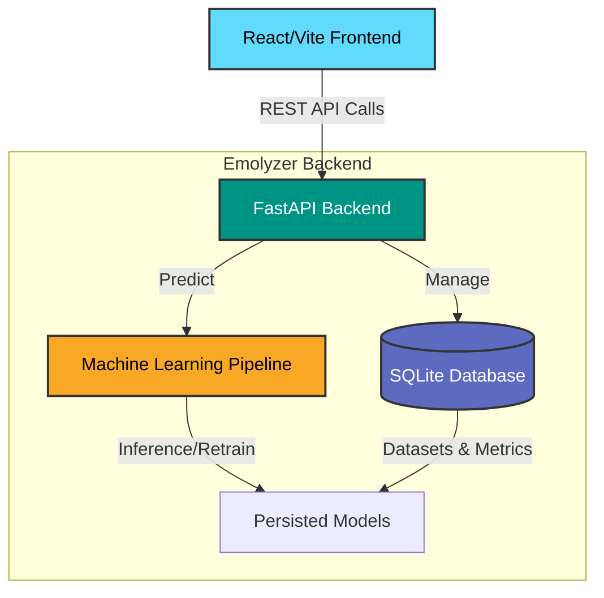

<div align="center">
  <h1> Emolyzer</h1>
  <p><b>Advanced Emotion Classification Platform</b></p>
  
  <p>
    
    
    
    
    
  </p>
</div>

<br/>

Emolyzer is a comprehensive, full-stack machine learning platform designed to classify natural language text into core emotional states. Engineered with a scalable React frontend and a modular FastAPI backend, the platform provides a robust, research-grade interface designed for real-time sentiment extraction and analysis.

## Overview

The system evaluates text to identify seven distinct emotions: Sadness, Joy, Love, Anger, Fear, Surprise, and Neutral. It handles complex linguistic nuances such as double negations and high-intensity signal boosting, making it highly effective for unstructured data like social media posts or conversational text.

## Core Features

- **Multi-Model Machine Learning Engine**: Evaluates text using Logistic Regression, Naive Bayes, and Support Vector Machines. It comes equipped with Platt scaling for precise probability calibration, ensuring confidence scores are statistically sound.
- **Deep Linguistic Processing Pipeline**: Incorporates conjunction-aware negation marking (e.g., handling complex structures like "I am not happy, but I will be okay") and high-intensity signal boosting for accurate contextual understanding.
- **Asynchronous Background Retraining**: Allows users to upload custom datasets to retrain the model on the fly. Heavy training operations are delegated to background workers to prevent blocking the main API event loop.
- **Persistent Data Tracking**: Integrates a local SQLite database utilizing the SQLAlchemy ORM to automatically track dataset metadata, cross-validation metrics, and model performance over time.
- **Modern User Interface**: Features a clean, academic aesthetic utilizing a soft pastel color palette, with smooth, staggered transitions provided natively by Framer Motion.

## Technology Stack

### Frontend Architecture
- **Framework**: React 18 with TypeScript and Vite for rapid module replacement and building.
- **State Management**: TanStack Query (React Query) for optimized server-state synchronization and caching.
- **Visuals and UI**: Framer Motion for seamless micro-animations; Recharts for live performance and distribution visualizations.

### Backend Architecture
- **API Framework**: FastAPI (Python) for high-performance, asynchronous REST endpoint generation.
- **Database and ORM**: SQLite paired with SQLAlchemy for persistent metric and dataset storage.
- **Machine Learning**: Scikit-Learn, Pandas, and custom NLP pipelines utilizing TF-IDF vectorization.
- **Performance**: Uvicorn ASGI server, SlowAPI for endpoint rate limiting, and Pydantic for rigid request and response model validation.

## System Architecture



## Getting Started

### Quick Start with Docker (Recommended)

The most straightforward method to run the complete stack is through Docker Compose, which builds the necessary containers for both the client and the server natively.

```bash
docker compose up --build
```

This command provisions and starts both the backend API on port `8000` and the React frontend on port `5173`. Hot-reloading is configured by default to ensure an optimized development workflow.

### Local Installation without Docker

If you prefer to run the components independently on your local machine, follow the steps below:

#### 1. Start the Backend API

First, create a virtual environment and install the required Python dependencies:

```bash
pip install -r requirements.txt
pip install slowapi sqlalchemy pydantic-settings ruff

python -m uvicorn api:app --reload --port 8000
```

#### 2. Start the Frontend Application

Next, navigate to the frontend directory, install the Node packages, and start the Vite development server:

```bash
cd frontend
npm install
npm run dev
```

## Research Methodology

The classification system leverages a stratified 5-fold cross-validation approach on a combined text corpus consisting of approximately 470,000 samples gathered from various public datasets (including Reddit, Twitter, and DAIR-AI).

During preprocessing, the system generates a TF-IDF matrix using unigrams and bigrams. The models are trained and calibrated to map detected emotional signals to the seven core classes. The pipeline natively filters out URLs, user mentions, and special characters while preserving punctuation that carries emotional weight, such as exclamation marks.

## Development and Contribution

To maintain code quality across the repository, the project relies on specific formatting and linting tools.

- **Frontend Configuration**: Execute `npm run format` to apply Prettier formatting.
- **Backend Configuration**: Execute `python -m ruff format . && python -m ruff check .` to format and check the Python codebase.

## Testing

To verify the integrity of the data processing and machine learning pipelines, run the included test suite with pytest:

```bash
pytest tests/
```
